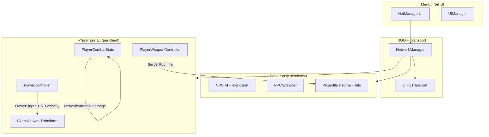
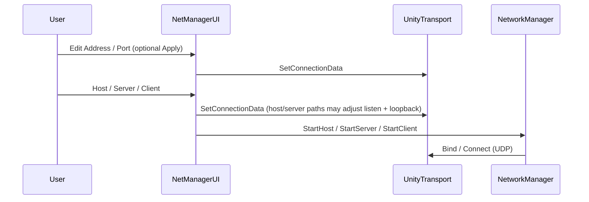

# GroupGame — System Architecture (Presentation Guide)

This document describes **what you built**: how multiplayer is wired, who owns what, and how weapons and spells flow from data assets to gameplay. It is aligned with the current code under `Assets/Scripts`, `Assets/hero/networkPref`, and related prefabs.

---

## 1. Technology stack

| Layer | Choice |
|--------|--------|
| Multiplayer API | **Unity Netcode for GameObjects (NGO)** |
| Transport | **Unity Transport (UTP)** — UDP, address + port |
| Scene objects | **NetworkObject** + spawn/despawn |
| Replicated state | **NetworkVariable** (server-writes, everyone reads) |
| Remote procedure calls | **ServerRpc** (client → server), **ClientRpc** (server → one or all clients) |
| Transform sync | **Client-authoritative** pattern via `ClientNetworkTransform` (extends NGO’s `NetworkTransform` with server authority **off** for the transform) on the player prefab |

You are **not** using Relay or Lobby in this repo yet; LAN / manual IP is what `NetManagerUI` and `ServerDiscovery` implement today.

---

## 2. Big picture (one slide)



**One sentence:** *Clients drive their own movement and send “I want to shoot” as ServerRpcs; the server spawns networked projectiles and resolves hits; NPC logic runs only on the server.*

---

## 3. How a client connects (step by step)

### 3.1 Components involved

- **`NetworkManager`** (scene): starts Host / Server / Client, owns connection state.
- **`UnityTransport`** (on same GameObject): holds **connection data** — IP to **connect to** as a client, port, and (for host/server) **listen** address (e.g. all interfaces `0.0.0.0`).
- **`NetManagerUI`**: menu buttons that call `StartHost`, `StartServer`, `StartClient`, and a popup to edit address/port and apply them to `UnityTransport` before starting.
- **`LanAddressUtility`**: discovers this machine’s LAN IPv4 for hints / broadcast targets.
- **`ServerDiscovery`**: optional **UDP beacons** on a separate **discovery port** (default **7779**) so a client can find a game **port** (default **7778**, configurable) on the LAN.

### 3.2 Host vs dedicated server vs client

| Button | What runs | Typical use |
|--------|------------|-------------|
| **Host** | Server **and** local player (`StartHost`) | Single machine that plays and listens; embedded “client” connects to **loopback** (`127.0.0.1`) on the server side while remote machines use the host’s **LAN IP**. |
| **Server** | Dedicated server only (`StartServer`) | No local player object from this build unless you add one; other PCs **Client** into this machine’s IP. |
| **Client** | Client only (`StartClient`) | Connects to the address/port in the UI (or via discovery if address is left empty — see code). |

`NetManagerUI` writes settings with `UnityTransport.SetConnectionData(...)`. For **Host**, the code intentionally sets the **client** side of the transport to **127.0.0.1** so the in-process client does not depend on hairpin NAT to the machine’s own LAN IP.

### 3.3 Connection flow (mental model)



After `IsListening` is true, **`UIManager`** hides the net menu panel so you drop into gameplay.

### 3.4 Discovery (LAN)

- **Server/Host** starts **`ServerDiscovery.StartServerBroadcast()`**, which periodically sends a small UTF-8 string with **game IP + game port** (format uses `|` so IPv4 is not broken by `:` splitting).
- **Client** with an **empty** address field may run **`StartClientDiscovery`**: listens on the discovery port; on match, sets transport to the discovered host and **`StartClient()`**.
- If you **typed an address**, the current logic connects **directly** with that IP (no overwriting the field from discovery).

---

## 4. Player architecture (prefab / components)

Typical **player** setup (see `Assets/hero/networkPref/Player.prefab`):

| Component | Role |
|-----------|------|
| **NetworkObject** | NGO identity, ownership, spawn. |
| **PlayerController** | **Owner-only** `Update` / `FixedUpdate`: reads input, moves **`Rigidbody2D`**, boundary check, death/respawn **ServerRpc**/**ClientRpc**. |
| **ClientNetworkTransform** | Replicates transform from **owner** to others (not server-authoritative). |
| **PlayerWeaponController** | **Owner-only** input; firing/casting → **ServerRpc**. |
| **PlayerCombatStats** | **`NetworkVariable<float> accumulatedDamage`**, knockback **ClientRpc** (owner applies force), server methods for damage/heal, teleport **ClientRpc** for owner. |

**Authority split (good for a slide):**

- **Client-authoritative:** position / ordinary movement (owner writes physics + transform sync).
- **Server-authoritative:** spawning projectiles, hit validation, damage totals, death flag from boundary, NPC behavior.

---

## 5. Movement (why it feels “client authoritative”)

- **`PlayerController.FixedUpdate`**: early return if **`!IsOwner`** — so **only the owning client** integrates movement into `Rigidbody2D`.
- Other clients and the server see the player move through **network transform replication**, not through them simulating your input.

**Knockback / teleports:** `PlayerCombatStats.ApplyKnockbackClientRpc` and `TeleportToPositionClientRpc` run on the **owner** and move the rigidbody there so it stays consistent with client authority (see comment in code).

---

## 6. Weapons — the full pipeline (your “spell data → object → controller” question)

### 6.1 Data layer (ScriptableObjects, not networked)

These live in the **Inspector** as references on **`PlayerWeaponController`**. They are **not** sent over the network as blobs; the **server** already has the same prefab/scene with the same assignments.

```
WeaponBase (abstract ScriptableObject)
├── PistolData          → pistol stats + pistol projectile prefab
└── SpellBase (abstract)
    └── ProjectileSpellData → spell stats + spell projectile prefab + SpellProjectileEffect
```

- **`WeaponBase`**: shared fields like `damage`, `cooldown`, `weaponName`.
- **`PistolData`**: `projectilePrefab`, speeds, lifetime for the default gun.
- **`ProjectileSpellData`**: `projectilePrefab`, `projectileSpeed`, `damage`, `projectileLifetime`, **`effect`** (`SpellProjectileEffect` enum), `knockbackBonus`, `leechHealAmount`, etc.

You **create assets** via **Create → Weapons → …** (see `CreateAssetMenu` on each type), tune numbers, then **drag** `PistolData` into `pistol` and up to three **`SpellBase`** assets into the `spells[3]` array on **`PlayerWeaponController`**.

### 6.2 Input (owner only)

`PlayerWeaponController.Update`:

- Only **`IsOwner`** runs weapon logic.
- **Aim**: mouse screen → world, direction from player to mouse.
- **Pistol**: LMB → **`FirePistolServerRpc(aimDir)`** + local cooldown timer.
- **Spells**: **Q / E / C** map to `spells[0..2]` → **`CastSpellServerRpc(spellIndex, aimDir)`** + per-slot cooldown.

Cooldowns are **local** (client-side timers). The server does not re-validate cooldown in the snippets you have — for a class project that is acceptable; production code would often mirror cooldown on the server.

### 6.3 ServerRpc (authoritative spawn)

On the **server**, `FirePistolServerRpc` / `CastSpellServerRpc`:

1. **`Instantiate`** the correct **`projectilePrefab`** at the player position.
2. Configure **`Projectile`** fields (`direction`, `speed`, `damage`, `lifetime`, **`ownerClientId`** = `OwnerClientId`, spell extras).
3. **`GetComponent<NetworkObject>().Spawn()`** — from then on, NGO replicates the projectile to all clients.

For spells, **`CastSpellServerRpc`** checks **`spells[spellIndex] is ProjectileSpellData`** — so the slot must hold a **`ProjectileSpellData`** asset (not a future non-projectile spell type unless you extend the RPC).

### 6.4 Projectile runtime (server-driven logic, replicated motion)

**`Projectile`** (`Projectiles.cs`):

- **Server**: applies hits in **`OnTriggerEnter2D`**, advances lifetime in **`FixedUpdate`**, **`Despawn()`** when done.
- **NetworkVariables** `netDirection`, `netSpeed`: server writes after spawn so **all peers** set **`Rigidbody2D.linearVelocity`** consistently; `OnValueChanged` handles late replication.
- **`SpellProjectileEffect`** switches behavior: damage+knockback, swap, gust, leech, pull, dash-on-expiry, etc. Swap/teleport use **`ClientRpcParams`** to hit **specific** owning clients.

So the mental model is:

```text
ScriptableObject (numbers + prefab reference)
    →  Owner calls ServerRpc(direction)
        →  Server Instantiate(prefab) + configure Projectile + NetworkObject.Spawn
            →  All machines see projectile; server alone decides hits and despawn
```

---

## 7. Death, respawn, and UI

- **Boundary**: owner’s **`PlayerController`** detects being outside **`boundaryRadius`** too long → **`RequestDeathServerRpc`**.
- **Server** sets dead flag and **`DieClientRpc`**: hides sprite, stops animation on everyone.
- **Respawn**: owner presses Space (when dead) → **`RequestRespawnServerRpc`** → **`RespawnClientRpc`** resets position to server-stored **`spawnPosition`**.
- **`UIManager`**: hides net UI when connected; uses **reflection** to read private `isDead` for game-over presentation (fragile but works for a prototype).

---

## 8. NPCs

- **`NPCSpawner`** (**server only**): timer spawns NPC prefabs with **`NetworkObject.Spawn`**, tracks count, spawns near a **`PlayerController`** found in the scene (see `NPCSpawner` for current “reference player” choice).
- **`NPC`**: on server, each **`FixedUpdate`** picks **nearest spawned** **`PlayerController`**, moves toward them, explodes into projectiles on proximity or when hit by a projectile; explosion uses **`ServerRpc`** on the NPC for spawning child shots (runs server-side).

---

## 9. Debugging helpers (optional mention in Q&A)

- **`ConnectionDebugger`**: logs listen address, port, and client connect target (if attached to **`NetworkManager`**).
- **`NETWORKING_DEBUG.md`**: checklist for “no route to host” / wrong LAN IP (may still refer to older `GAMESERVER:` string examples; beacon format in code may have evolved).

---

## 10. Folder map (where things live)

| Area | Path |
|------|------|
| Net menu + transport wiring | `Assets/Scripts/NetScript/NetManagerUI.cs` |
| LAN IP helpers | `Assets/Scripts/NetScript/LanAddressUtility.cs` |
| UDP discovery | `Assets/Scripts/NetScript/ServerDiscovery.cs` |
| Client-authoritative transform | `Assets/Scripts/NetScript/ClientNetworkTransform.cs` |
| Player movement, death | `Assets/Scripts/PlayerScripts/PlayerController.cs` |
| Weapons + ServerRpcs | `Assets/Scripts/PlayerScripts/PlayerWeaponController.cs` |
| Weapon / spell **data** | `Assets/Scripts/PlayerScripts/PistolData.cs`, `WeaponBase.cs`, `Assets/hero/networkPref/SpellBase.cs`, `ProjectileSpellData.cs` |
| Projectile simulation | `Assets/Scripts/PlayerScripts/Projectiles.cs` |
| Damage / knockback / heal | `Assets/Scripts/PlayerScripts/PlayerCombatStats.cs` |
| NPC | `Assets/Scripts/PlayerScripts/NPC.cs` |
| NPC spawn | `Assets/Scripts/PlayerScripts/NPCSpawner.cs` |
| In-game UI shell | `Assets/Scripts/UIManager/UIManager.cs` |
| Player prefab | `Assets/hero/networkPref/Player.prefab` |

---

## 11. Suggested “talk track” (30 seconds)

> “We use Netcode for GameObjects with Unity Transport. Each player owns their movement and we replicate it with a client-authoritative Network Transform. Gameplay that must be fair — shooting, projectiles, damage, and NPCs — runs on the server: the client only sends ServerRpcs with aim direction and slot index. Weapons are designed as ScriptableObjects so designers can tune prefabs and damage without code changes; the server instantiates the projectile prefab from that data and spawns it as a networked object so everyone sees the same shots.”

---

*Generated from the repository state; if you rename ports, discovery format, or authority modes, update this file in the same commit.*
